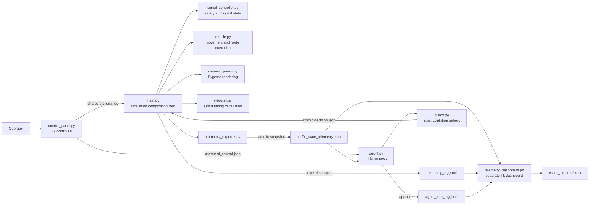
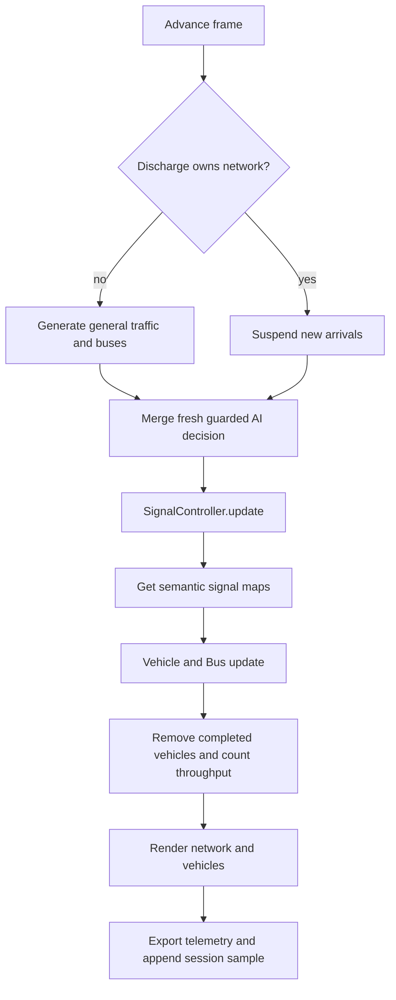
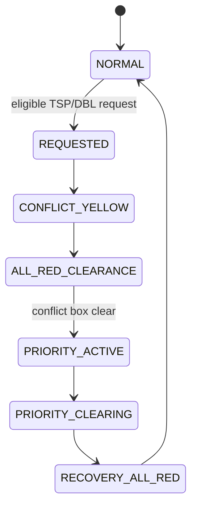
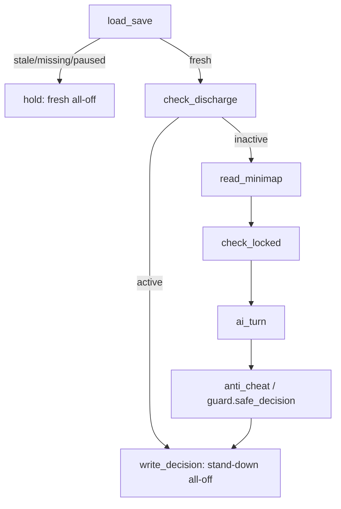
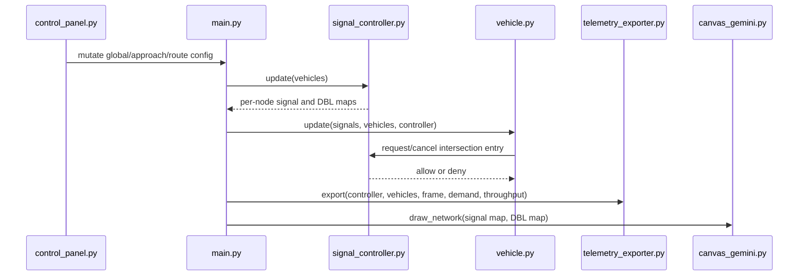
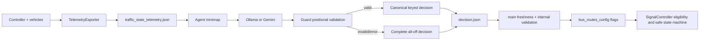

# Traffic Simulator Architecture and Reuse Guide

> Current-source guide for coding agents  
> Project root: `C:\Users\ascen\python_projects\traffic_simulator`  
> Verified against the working tree on 2026-09-10

## 1. Purpose of this document

This document teaches a coding LLM how the simulator is assembled, which Python file owns each responsibility, how data moves between processes, and which parts can be reused in another application. It is an architecture guide, not a replacement for the source code.

Use the actual `.py` files as the final authority. The project has changed substantially over time, so older audit reports and documents may describe earlier designs. In particular, the current signal controller has **independent state for Node A and Node B**; it is not one shared phase clock.

### What the system does

The application simulates a two-intersection urban corridor with:

- two independently controlled intersections at x-coordinates 300 and 700;
- eastbound, westbound, northbound, and southbound traffic;
- cars, trucks, and six configurable bus routes;
- normal Webster-derived signal timing;
- Transit Signal Priority (TSP);
- a Dynamic Bus Lane (DBL);
- conflict reservations, downstream-spillback checks, and all-red clearance;
- manual/automatic gridlock discharge;
- an optional separate-process LLM supervisor;
- live telemetry, session trends, and Excel export;
- deterministic traffic generation when a random seed is supplied.

### Recommended reading order for another coding agent

1. Read this guide completely.
2. Read `canvas_gemini.py` for the coordinate system.
3. Read `control_panel.py` for configuration schemas.
4. Read `vehicle.py` and `signal_controller.py` together; their safety contract is bidirectional.
5. Read `webster.py` and the calibration functions in `main.py`.
6. Read `main.py`, the composition root and simulation loop.
7. Read `telemetry_exporter.py` and `telemetry_dashboard.py`.
8. Read `guard.py` before `agent.py` so the trusted decision boundary is clear.
9. Read the tests before extracting or redesigning a subsystem.

## 2. Architecture at a glance

The application is one simulation process plus two child processes:



### Ownership rule

| Concern | Authoritative owner | Consumers |
|---|---|---|
| Road geometry | `canvas_gemini.py` | `main.py`, `vehicle.py`, `signal_controller.py`, telemetry |
| Operator configuration | `control_panel.py` dictionaries | `main.py`, controller, exporter, agent control file |
| Vehicle collection and simulation clock | `main.py` | controller, exporter, renderer |
| Vehicle kinematics and route progress | `vehicle.py` | `main.py`, controller, exporter |
| Right-of-way and collision safety | `signal_controller.py` | vehicles, renderer, telemetry |
| Baseline green splits | `webster.py`, applied by `main.py` | controller, telemetry, UI |
| Live state serialization | `telemetry_exporter.py` | dashboard, agent |
| LLM output validation | `guard.py` | agent and main merge boundary |
| LLM policy loop | `agent.py` | writes a suggestion; never directly moves vehicles |
| Visualization/export | `telemetry_dashboard.py` | operator and research workflow |

The most important design boundary is:

> The LLM may request route flags, but `SignalController` remains the final safety authority. Never move collision checks, all-red clearance, reservations, or spillback protection into the prompt.

## 3. Network model and shared vocabulary

### Geometry

`canvas_gemini.py` defines the canonical network geometry:

```python
WIDTH, HEIGHT = 1000, 600
LANE = 22
LANES = 3
ROAD_W = 2 * LANE * LANES  # 132 px
H_Y = 300
INT_X = [300, 700]          # Node A and Node B
STOP = 10
```

- Node A is `x=300`; Node B is `x=700`.
- `H_Y=300` is the horizontal corridor centerline.
- Each carriageway has three lanes.
- Lane index 2 is the outer/DBL/left-turn lane.
- Directions are semantic strings: `EB`, `WB`, `NB`, and `SB`.
- Signal colors are semantic strings: `RED`, `YELLOW`, and `GREEN`.

### Vehicle types and passenger objective

`vehicle.py` defines the objective weights:

```python
CAR_PASSENGERS = 4
TRUCK_PASSENGERS = 1
DBL_LANE_INDEX = 2
```

- A normal `Vehicle` carries 4 passengers.
- A heavy `Vehicle`/truck carries 1 passenger.
- A `Bus` overrides the inherited value and carries 45 passengers.
- Throughput is credited only after a vehicle exits the screen **and** its `passed_nodes` set is non-empty.

This is a passenger-throughput simulator, not simply a vehicle-count simulator. Preserve these distinctions in any reuse unless the new product intentionally changes the objective.

### Six bus routes

The live route schema is in `control_panel.bus_routes_config`:

| Position | Route ID | Movement |
|---:|---|---|
| 1 | `R1_EB_A_NB` | EB to Node A, then NB |
| 2 | `R2_EB_B_NB` | EB through A, left at B to NB |
| 3 | `R3_EB_ONLY` | EB straight through both nodes |
| 4 | `R4_WB_A_SB` | WB through B, left at A to SB |
| 5 | `R5_WB_B_SB` | WB to Node B, then SB |
| 6 | `R6_WB_ONLY` | WB straight through both nodes |

Do not copy this table into executable code. The executable canonical order is defined once:

```python
# guard.py
ROUTE_ORDER = sorted(control_panel.bus_routes_config.keys())
```

### Normal signal cycle

Each node has its own `NodeState` and cycles independently:

```text
0 EW_GREEN
1 EW_YELLOW
2 ALL_RED
3 NS_GREEN
4 NS_YELLOW
5 ALL_RED
repeat
```

At construction/reset:

```python
self.nodes = {node_x: NodeState() for node_x in INT_X}
```

Compatibility properties named `phase` and `timer` expose Node A on read and broadcast setup values on write. They are not shared runtime storage.

## 4. Runtime lifecycle

### Launch

Run:

```powershell
.\myenv\Scripts\python.exe main.py
```

`main.py`:

1. initializes Pygame;
2. calculates non-overlapping window positions;
3. creates `SignalController` and `TelemetryExporter`;
4. creates the Tk control panel;
5. starts `telemetry_dashboard.py` and `agent.py` as child Python processes;
6. enters the Tk event loop and schedules a simulation callback every 16 ms.

The simulator launches idle because `global_config["is_running"]` defaults to `False`. The operator can set seed, speed, demand, model, and test duration before pressing START.

### START, STOP, PAUSE, and RESET

- **START** requests a completely new run. It clears vehicles, controller runtime state, logs, throughput, and spawner state; calibrates saturation flow; applies the current seed and speed scale; then begins at frame 0.
- **STOP** halts stepping but deliberately preserves vehicles, logs, and throughput for export.
- **PAUSE** freezes the current run in place and resumes the same state.
- **RESET** performs the same full reset helper used by START. Export before RESET if the old run must be retained.

The shared reset implementation is:

```python
def perform_full_reset(vehicles, signals, telemetry=None):
    vehicles.clear()
    signals.reset_all_state()
    if telemetry is not None:
        telemetry.reset_session()
    reset_session_logs()
    network_throughput.update({key: 0 for key in network_throughput})
    calibrate_and_apply_webster(signals)
    reset_traffic_generation()
    return 0
```

### Fixed-step loop

Physics runs at a logical 60 frames per simulated second. `sim_speed` controls how many fixed steps are consumed per wall-clock interval; it does not change the physics timestep. Catch-up work is bounded so dragging a window cannot create a large frozen replay.

One logical step performs this sequence:



Rendering and telemetry continue while stopped or paused, so the windows remain interactive and the frozen state remains inspectable.

## 5. Python module reference

### 5.1 `main.py` — composition root and simulation runtime

**Purpose:** Assemble every subsystem and own the mutable run-level state.

**Owns:**

- the single `vehicles` list used for both cars/trucks and buses;
- `master_frame_count` and fixed-step scheduling;
- traffic generation state and bus dispatch counters;
- passenger/vehicle throughput counters;
- process startup and cleanup;
- START/RESET orchestration;
- decision-file merge;
- session JSONL and benchmark workbook creation.

**Important entry points:**

- `main()` — launches the application.
- `perform_full_reset(...)` — resets a run atomically at the application level.
- `try_spawn_vehicle(...)` — creates cars/trucks after demand and gap checks.
- `check_and_dispatch_buses(...)` — creates `Bus` objects from route configs.
- `merge_ai_decision(...)` — validates freshness and internal flag structure before changing live route flags.
- `calibrate_saturation_flow(...)` and `calibrate_and_apply_webster(...)` — derive the baseline timing at run start.
- `export_session_excel(...)` / `export_test_workbook(...)` — produce research outputs.

**Throughput path:**

```python
if vehicle_is_outside_screen:
    if len(getattr(v, "passed_nodes", set())) > 0:
        passengers = int(getattr(v, "passengers", 0))
        network_throughput["passengers_served_total"] += passengers
        network_throughput["vehicles_served_total"] += 1
        if isinstance(v, Bus):
            network_throughput["passengers_served_bus"] += passengers
            network_throughput["buses_served"] += 1
        else:
            network_throughput["passengers_served_car"] += passengers
            network_throughput["cars_served"] += 1
```

**Reuse assessment:**

- Reuse the fixed-step pattern, deterministic seeding, demand generators, throughput accounting, and lifecycle semantics.
- Do not copy `main.py` wholesale into a server or library. It mixes orchestration, GUI startup, spawning, logging, calibration, and export.
- For a new product, extract a `SimulationEngine.step()` class first, then wrap it with a GUI, API, batch runner, or reinforcement-learning environment.

### 5.2 `control_panel.py` — configuration schemas and operator UI

**Purpose:** Define all operator-facing configuration and build the Tkinter control panel.

**Owns three important dictionaries:**

1. `global_config` — lifecycle, seed, simulation speed, priority range, vehicle speed, Webster output, discharge commands/status, and AI runtime.
2. `approach_configs` — enabled state, arrival model, rate, straight/turn split, and heavy-vehicle ratio for six approaches.
3. `bus_routes_config` — route topology, lanes, headway, manual dispatch, and TSP/DBL flags.

Representative schemas:

```python
global_config = {
    "is_running": False,
    "is_paused": False,
    "random_seed": None,
    "priority_eligibility_px": 500,
    "vehicle_speed_scale": 0.5,
    "webster_splits": {},
    "discharge_runtime": {...},
    "ai_runtime": {
        "armed": False,
        "model": "None",
        "tick_seconds": 5,
        "last_status": "INACTIVE",
        "last_turn": 0,
    },
}

approach_configs["EB"] = {
    "active": True,
    "model": "Poisson",
    "rate": 12,
    "turn_split": 0.80,
    "heavy_ratio": 0.10,
}
```

**UI behavior:**

- Bus Route Manager and per-approach traffic parameters are collapsible.
- Sliders acquire focus when clicked and respond to Left/Right for precise changes.
- START/STOP is separate from PAUSE/RESUME.
- Seed, speed scale, and eligibility distance are pending settings applied on START/RESET.
- Local Ollama models are discovered through `ollama list`, with fallback labels if discovery fails.
- API models are exposed only when the associated provider key exists.
- `write_ai_control()` atomically writes the small cross-process control contract.

**Reuse assessment:**

- Reuse the configuration schemas if the new software keeps the same concepts.
- Separate schemas from Tk widgets before using them in a web service or alternate UI.
- Treat dictionary mutations as commands from the UI, not safety approval. Safety remains in `SignalController`.

### 5.3 `canvas_gemini.py` — network geometry and Pygame rendering

**Purpose:** Define drawing geometry and render roads, lane markings, intersections, signal heads, and DBL indicators.

**Important functions:**

- `_resolve_signal_color(state)` — maps semantic signal states to RGB and fails safely to red.
- `_get_dbl_flash_clock(is_paused)` — pauses the DBL animation clock correctly.
- `draw_intersection(...)` — draws stop bars, signal heads, and DBL indicators for one node.
- `draw_network(...)` — draws the complete network.

The renderer consumes state but does not decide right-of-way:

```python
canvas.draw_network(
    screen,
    signal_data=signals.get_all_signals(canvas.INT_X),
    dbl_states=signals.get_all_dbl_states(canvas.INT_X, vehicles),
    font=font,
    is_paused=is_paused or not is_running,
)
```

**Reuse assessment:**

- Good candidate for reuse in another Pygame application.
- Geometry constants are currently coupled to movement and controller code. For a differently shaped network, extract them into a shared immutable network model rather than changing only the renderer.
- Preserve semantic signal input. UI colors must never become the source of traffic behavior.

### 5.4 `vehicle.py` — movement, lane changes, route progression, and spillback

**Purpose:** Model vehicle physics and enforce each vehicle's local movement constraints.

**Main types:**

- `Vehicle` — cars and trucks.
- `Bus(Vehicle)` — fixed-route bus with 45 passengers and per-leg route metadata.

**`Vehicle` owns:** position, direction, length/width, speed, acceleration, lane, turn, `passed_nodes`, intersection reservation metadata, and movement state.

**`Bus` adds:** route ID, ordered route nodes, route-leg lookup, DBL merge tracking, post-node route merge behavior, and bus rendering.

**Safety collaboration:**

- A vehicle reads a semantic signal map.
- On green near a stop bar, it checks downstream storage.
- It asks `SignalController.request_intersection_entry(...)` for final permission.
- The controller records/resolves reservations.
- A node is added to `passed_nodes` only after the vehicle's rear has cleared the conflict box.

Focused entry gate:

```python
if sig_state == "GREEN" and 0.0 <= dist_to_stop <= 25.0:
    if self.route_exit_merge_blocked:
        should_stop = True
    elif self.is_spillback_blocked(target_node_x, h_y, road_w, all_vehicles):
        should_stop = True
    elif signal_controller and not signal_controller.request_intersection_entry(
        self, target_node_x, all_vehicles
    ):
        should_stop = True
```

**DBL and route-lane behavior:**

- An enabled DBL bus tries to migrate to lane index 2 early.
- It uses the existing smooth lane-change and obstruction checks.
- A route-required turn/next-leg lane takes precedence when necessary.
- A DBL-only merge can be abandoned after a bounded wait so DBL cannot leave the bus worse than baseline.
- Route-required merges are not abandoned, because the bus needs the correct lane to complete its route safely.

**Reuse assessment:**

- Reuse route-leg representation, collision spacing, spillback checks, and the separation between local kinematics and central right-of-way.
- The code is coordinate-specific and assumes axis-aligned approaches. A new map needs a geometry abstraction or graph-based paths.
- Never reuse only `Vehicle.update` without its `SignalController` reservation contract; the two jointly implement intersection safety.

### 5.5 `signal_controller.py` — authoritative safety and signal state machine

**Purpose:** Own normal phases, per-node priority, movement conflicts, reservations, DBL eligibility, and network discharge.

**Core data classes:**

```python
@dataclass
class PriorityRequest:
    request_id: str
    route_id: str
    bus_id: str
    target_node_x: int
    route_leg_index: int
    approach: str
    movement: str
    entry_lane: int
    conflicts: set
    created_frame: int
    state: str = REQUESTED
    # plus timing, grant, and terminal fields

@dataclass
class NodeState:
    phase: int = 0
    timer: int = 0
    priority_state: str = NORMAL
    # plus active/queued requests, reservations, history, watchdog state
```

**Independent-node invariant:**

```python
self.nodes = {node_x: NodeState() for node_x in INT_X}
```

Every node has its own phase, timer, request queue, active request, reservations, and recovery state.

**Normal timing:** `get_green_time(node_x)` reads the per-node Webster split from `global_config["webster_splits"]`; yellow and all-red durations are constructor configuration.

**Priority state flow:**



Requests may also terminate as completed, denied, cancelled, timed out, infeasible, or watchdog-cleared. The controller, not the LLM, resolves those outcomes.

**Intersection entry:** `request_intersection_entry(...)` is the final collision-prevention gate. It checks network discharge ownership, signal state, active priority, reservations, and conflicting occupants.

**DBL eligibility:** a bus must have an enabled live route flag, be approaching the correct leg/node, be in the required DBL lane, and be within the configured eligibility distance. The controller supplies the authoritative live answer used by both priority requests and bus migration.

**Discharge/recovery:**

- Supports Auto plus six operator-selected corridor plans.
- Suspends new arrivals and normal priority while active.
- Uses yellow and all-red transition stages rather than jumping directly between conflicting greens.
- Reports `WAITING`, `DISCHARGING`, `RECOVERY_FAILED`, stopping, and transition states.
- Auto rotates through physical approaches and chooses/recommends stages based on recoverable storage.

**Full reset:** `reset_all_state()` preserves constructor configuration but resets frame number, fresh node objects, request sequence, attempt counters, discharge state/timers/plan/tracking/progress, and pending discharge commands.

**Reuse assessment:**

- This is the highest-value reusable safety component.
- Reuse it together with its tests and semantic movement conventions.
- If the new system changes geometry, encode conflicts explicitly rather than weakening entry checks.
- Never directly set green for TSP/DBL. Submit a request and let the state machine execute yellow, all-red, exclusive green, and recovery.

### 5.6 `webster.py` — pure baseline signal-timing calculations

**Purpose:** Calculate deterministic two-phase Webster cycle lengths and EW/NS green splits from demand and measured saturation flow.

It contains no GUI, Pygame, file I/O, or mutable application state.

Main API:

```python
splits = webster.compute_all_nodes(
    control_panel.approach_configs,
    saturation_flow_veh_per_hr,
    lost_time_sec=lost_time,
)
```

For each node it:

- takes the maximum of EB/WB as the critical EW flow;
- takes the maximum of that node's NB/SB as the critical NS flow;
- computes flow ratios `y=q/S` and total `Y`;
- derives the Webster-optimal cycle where valid;
- uses a bounded cycle when demand is oversaturated;
- distributes effective green in proportion to phase critical ratios.

**Reuse assessment:** Excellent standalone extraction candidate. Its pure inputs/outputs make it suitable for services, notebooks, batch analysis, or another simulator. Verify that the new network still uses two compatible phase groups before reusing its equations unchanged.

### 5.7 `telemetry_exporter.py` — authoritative live snapshot producer

**Purpose:** Convert in-memory simulation/controller objects into one JSON-safe schema and write it atomically.

`TelemetryExporter.export(...)` writes only every configured number of frames. It creates a temporary file, flushes and fsyncs it, then uses `os.replace` so consumers never see half-written JSON.

Top-level payload:

```json
{
  "schema_version": 3,
  "timestamp": 0.0,
  "frame_number": 0,
  "simulation_time_seconds": 0.0,
  "simulation_running": false,
  "simulation_paused": false,
  "signal_timing": {},
  "simulation_speed": 1.0,
  "signal_state": {},
  "network_discharge": {},
  "network_summary": {},
  "network_throughput": {},
  "demand_generation": {},
  "routes": {},
  "active_buses": [],
  "approaching_buses": []
}
```

**Important nested information:**

- `signal_state.nodes["300"|"700"]` includes controller status, phase, signals, vehicle queues, passenger-estimated queues, and total waiting passenger estimate.
- `network_discharge.active` is the authoritative stand-down flag for external controllers.
- `network_discharge.controller_state` exposes detailed transition/recovery state, including `RECOVERY_FAILED`.
- `network_summary` contains vehicles, buses, passenger volume, queues, pending demand, and per-node queues.
- `network_throughput` contains served passenger and vehicle counts plus cumulative/recent passengers per minute.
- `routes` summarizes live TSP/DBL flags, approaching buses, nearest ETA, DBL-lane occupancy, and obstruction.
- `active_buses` exposes per-bus position, speed, passenger count, lane, route leg, ETA, and priority lifecycle.

Queue passenger estimates use four passengers per queued vehicle because the aggregated queue counter no longer retains vehicle type. This can overestimate a queue containing trucks. Completed-trip throughput uses each vehicle's actual `passengers` value and is the more reliable objective metric.

**Reuse assessment:**

- Reuse the schema and atomic-write pattern for an external API or monitoring service.
- Replace direct imports of `control_panel` and canvas geometry with explicit arguments if extracting it as a library.
- Treat `schema_version` as a real compatibility boundary; increment it for breaking payload changes.

### 5.8 `telemetry_dashboard.py` — live monitoring and Excel reporting

**Purpose:** Run a separate Tk process that observes files without blocking simulation physics.

**Tabs:**

- **Summary** — uniform KPI strip, node state, queues, phase diagram, and discharge/priority status.
- **Session Trends** — bounded in-memory time series for vehicles, buses, queues, pending demand, and congestion.
- **LLM Performance** — per-turn status, latency, tokens, throughput, and optional GPU telemetry.

The dashboard polls the telemetry snapshot every 250 ms and reschedules itself in `finally`, so one read/update error does not permanently stop monitoring.

The trend history is process-local and intentionally cleared when the dashboard closes or detects a backwards frame/time jump. No historical database is required.

`EXPORT ALL` builds one timestamped workbook containing, when data is available:

- Decisions;
- Telemetry;
- LLM Performance;
- LLM Summary;
- Control Panel Inputs;
- current Snapshot sheets;
- Session Trends data;
- editable native Excel line charts in `Session Charts`.

**Reuse assessment:**

- Reuse parsing, status classification, bounded time-series sampling, and workbook generation independently of the Pygame canvas.
- The UI is Tk-specific. For web reuse, preserve the telemetry schema and replace widget-building code.
- GPU figures are observational and loosely attributed; do not interpret them as exclusive per-model process usage without stronger instrumentation.

### 5.9 `guard.py` — trusted LLM decision boundary

**Purpose:** Make malformed or adversarial model output fail safely to a complete all-off decision.

The model-facing contract contains no route IDs:

```json
{
  "reason": "one sentence",
  "tsp": [false, false, false, false, false, false],
  "dbl": [false, false, false, false, false, false]
}
```

`validate_flags_positional(...)` requires two lists of exactly the canonical route count and strict Python booleans. It maps positions to trusted IDs:

```python
return {
    route_id: {"tsp": tsp[index], "dbl": dbl[index]}
    for index, route_id in enumerate(ROUTE_ORDER)
}
```

The internal `decision.json` remains keyed by route ID because only the guard creates that representation. `validate_flags(...)` separately validates this trusted internal format when `main.py` reads it.

**Failure behavior:** bad JSON, wrong lengths, extra/missing route maps, strings such as `"true"`, integers such as `1`, or any exception lead to `HELD_ALL_OFF`. Rejections are appended to `agent_rejects.log` where possible.

**Reuse assessment:** Reuse this fail-closed boundary whenever an LLM controls a safety-adjacent system. Adapt the schema, but retain exact validation, canonical mapping, timestamping, and safe fallback. Do not add fuzzy route-ID repair.

### 5.10 `agent.py` — optional LLM supervisory process

**Purpose:** Observe the current network, ask a selected model for restrained TSP/DBL suggestions, pass output through the guard, and atomically publish a decision.

The agent supports:

- local Ollama models;
- configured Gemini API models;
- structured Ollama output where supported, with a compatibility fallback;
- 45-second Ollama and 30-second Gemini timeout wrappers;
- telemetry staleness protection;
- discharge stand-down;
- decision-latency-aware bus actionability;
- route-lock awareness during an active grant;
- per-node passenger/queue summaries;
- per-turn JSONL observability;
- turn counter/memory reset when telemetry frame numbers jump backwards.

Graph flow:



The minimap is structured text, not an image. It includes both node-wide competing queues and numbered route details. The prompt tells the model that Webster is the competent baseline, congestion is failure, all-off is often correct, no approaching bus must receive no priority, and a bus must remain actionable after expected inference latency.

Discharge gate:

```python
if bool(discharge.get("active", False)):
    # publish a fresh STANDDOWN_DISCHARGE decision with all flags off
    # and skip read_minimap / model inference
```

**What the agent does not do:**

- It does not change signal heads directly.
- It does not bypass the guard.
- It does not grant a reservation.
- It does not replace Webster timing.
- It does not run while the simulation is stopped or the AI is disarmed.

**Reuse assessment:**

- Reuse the process isolation, structured observation, strict output contract, timeouts, stand-down gate, and decision logs.
- Keep the agent advisory. A deterministic domain controller must still arbitrate its requests.
- For another product, replace the minimap and flag schema while preserving the guard-first integration pattern.

### 5.11 `measure_saturation.py` — offline calibration diagnostic

**Purpose:** Run repeatable HCM-style queue-discharge experiments across speed scales, heavy-vehicle ratios, and seeds.

It imports production geometry, vehicles, controller, and calibration logic, but it is not part of the normal application runtime. Use it to validate whether the saturation-flow assumptions used by Webster remain credible after movement changes.

**Reuse assessment:** Reuse as a research script or convert it into a benchmark fixture. Do not make the live application import this script; keep diagnostics outside the runtime dependency path.

## 6. Cross-file contracts and data flow

### 6.1 In-process calls



### 6.2 Cross-process files

All runtime file paths are relative to the source directory, not the terminal's current directory.

| File | Writer | Reader(s) | Semantics |
|---|---|---|---|
| `ai_control.json` | `control_panel.py` | `agent.py` | Armed state, selected model, tick interval, simulation-running flag |
| `traffic_state_telemetry.json` | `telemetry_exporter.py` in main process | dashboard, agent | Latest authoritative snapshot; atomically replaced |
| `decision.json` | `agent.py` | `main.py` | Latest guarded internal keyed flags; atomically replaced |
| `telemetry_log.jsonl` | `main.py` | dashboard/exporters | Append-only, roughly one sample per simulated second |
| `agent_turn_log.jsonl` | `agent.py` | dashboard/exporters | Append-only per-turn decision/performance record |
| `agent_rejects.log` | `guard.py` | developer/operator | Best-effort malformed-output evidence |
| `excel_exports/*.xlsx` | main/dashboard | operator | Durable benchmark/session reports |

### 6.3 LLM decision journey



`main.py` rejects stale decisions using a timeout of `max(3 * agent_tick, 12 seconds)`. On invalid or stale data it applies all-off flags.

## 7. Safety invariants a reuse effort must preserve

1. **Semantic state is authoritative.** Vehicles act on `RED/YELLOW/GREEN`, not rendered RGB values.
2. **Nodes are independent.** Never collapse the two `NodeState` objects into a shared phase/timer unless intentionally redesigning coordination.
3. **Green is necessary but not sufficient.** A vehicle also needs downstream storage and controller entry permission.
4. **All-red is a transition, not a direction.** It clears conflicting occupants before the next movement receives green.
5. **Reservations are movement-specific.** A new movement may enter only if it does not conflict with active reservations/occupants.
6. **`passed_nodes` means rear-clear completion.** Do not mark a node passed at the stop bar or vehicle center.
7. **Priority is a request.** TSP/DBL never directly changes a signal to green.
8. **Discharge owns the network while active.** Arrivals and LLM priority are suspended until recovery releases control.
9. **DBL must not make a bus worse than baseline.** Optional DBL merges have bounded fallback; route-required movement remains safe.
10. **Model output is untrusted.** Only strict positional booleans become canonical route flags.
11. **Freshness is mandatory.** Old `decision.json` must not remain active after the agent stalls.
12. **Run isolation matters.** START/RESET clear run logs and state; STOP preserves them for export.
13. **Seed comparison has a limited claim.** The same seed reproduces traffic generation. Armed runs may diverge because model outputs can be nondeterministic.
14. **Queue passenger counts are estimates.** Served-passenger counters are based on actual per-vehicle occupancy.

## 8. What can be reused for a new software product

### Option A — headless traffic engine

Reuse:

- `Vehicle` and `Bus` behavior;
- `SignalController` and its state machines;
- `webster.py`;
- spawning and throughput functions from `main.py`;
- `TelemetryExporter.build_payload` as an observation interface.

Refactor first:

```python
class SimulationEngine:
    def __init__(self, config, network): ...
    def reset(self, seed=None): ...
    def step(self, action=None): ...
    def observe(self) -> dict: ...
```

Keep Pygame, Tk, subprocess launching, and Excel outside this class.

### Option B — web dashboard or remote control service

Reuse:

- telemetry schema;
- control and decision schemas;
- exporter calculations;
- dashboard KPI definitions;
- guard validation.

Replace:

- Tk widgets with an HTTP/WebSocket frontend;
- source-relative JSON polling with a versioned message bus or API;
- in-process dictionaries with validated configuration objects.

Keep atomicity or transactional semantics. A consumer must never observe half of a state update.

### Option C — research benchmark runner

Reuse:

- seeded spawn logic;
- START/full-reset semantics;
- fixed 60 Hz clock;
- JSONL records;
- timed tests and workbook summaries;
- `measure_saturation.py`.

Add a non-GUI batch entry point so many seeds and armed/disarmed pairs can run automatically. Compare same-seed baseline versus intervention, and retain config values beside every result.

### Option D — LLM controller for another domain

Reuse the pattern, not the traffic vocabulary:

1. produce a compact current-state observation;
2. use a fixed positional or enumerated output contract;
3. validate strict types and dimensions;
4. fail closed;
5. enforce freshness;
6. add subsystem ownership/stand-down gates;
7. let a deterministic arbiter execute safe transitions;
8. log raw output, validated action, latency, and outcome separately.

### Option E — baseline simulator without any LLM

Select model `None` or leave AI disarmed. The existing Webster controller remains complete and the application does not require an LLM decision to run. When extracting this mode, omit `agent.py` and `guard.py`, and remove only the process/control-file integration—not controller safety.

## 9. Recommended decoupling plan before major reuse

1. Create a `NetworkGeometry` immutable object and move constants out of the renderer.
2. Replace mutable module dictionaries with typed configuration data classes.
3. Create `SimulationState` for vehicles, clocks, counters, and demand state.
4. Move `simulation_step` from nested `main()` scope into `SimulationEngine.step()`.
5. Inject RNG (`random.Random(seed)`) rather than using the global module if multiple simulations must run concurrently.
6. Give telemetry exporter explicit config/geometry inputs instead of importing UI modules.
7. Define versioned `ControlCommand`, `TelemetryFrame`, and `PriorityDecision` schemas.
8. Keep the current controller/vehicle integration intact while each boundary is replaced.
9. Preserve and run the existing adversarial tests after every extraction step.
10. Add a headless end-to-end test before building a new UI.

Suggested package shape:

```text
new_product/
├── domain/
│   ├── geometry.py
│   ├── config.py
│   ├── vehicles.py
│   └── signals.py
├── engine/
│   ├── simulation.py
│   ├── demand.py
│   └── webster.py
├── integrations/
│   ├── telemetry.py
│   ├── llm_agent.py
│   └── decision_guard.py
├── ui/
│   └── ...
└── tests/
```

## 10. Testing map

Run the full suite from the project root:

```powershell
.\myenv\Scripts\python.exe -m pytest -q
```

The current test groups communicate the intended architecture:

| Test module | Main responsibility |
|---|---|
| `test_vehicle_safety.py` | signals, spillback, turns, lane behavior, throughput movement prerequisites |
| `test_signal_priority.py` | TSP/DBL eligibility and priority lifecycle |
| `test_signal_controller_reset.py` | full controller reset and independent node state |
| `test_network_discharge.py` | discharge transitions, status, failure, safe stop |
| `test_discharge_clockwise.py` | automatic recovery ordering |
| `test_adversarial_simulation.py` | cross-module safety under difficult traffic |
| `test_route_completion.py` | six route geometries and completion |
| `test_runtime_and_telemetry.py` | startup, files, telemetry, callbacks, logging, exports |
| `test_llm_control_loop.py` | model loop, guard, staleness, stand-down, model APIs |
| `test_decision_latency.py` | ETA/actionability logic |
| `test_dbl_obstruction_telemetry.py` | DBL obstruction observability |
| `test_dbl_merge_fallback.py` | bounded DBL merge fallback |
| `test_motion_tuning.py` | speed scaling and eligibility distance |
| `test_webster_timing.py` | Webster calculations and run-start calibration |
| `test_timed_benchmark.py` | benchmark lifecycle and exports |
| `test_dashboard_layout.py` | responsive/scrollable dashboard behavior |
| `test_control_panel_collapsible.py` | disclosure panels, keyboard sliders, sizing |

For extracted software, retain at least these acceptance layers:

1. pure unit tests for timing and schemas;
2. movement/controller contract tests;
3. adversarial conflict and spillback tests;
4. seeded headless end-to-end route tests;
5. malformed/stale external-command tests;
6. reset/reproducibility tests;
7. UI smoke tests only after the engine tests pass.

## 11. Dependency and deployment notes

`requirements.txt` currently declares:

```text
pygame>=2.5,<3
ollama>=0.6,<1
google-genai>=1,<2
langgraph>=1.2,<2
openpyxl>=3.1,<4
pytest>=8,<10
```

Tkinter is supplied by the standard Windows Python installation and is not installed from PyPI.

Operational notes:

- Ollama is optional for baseline simulation but required for local-model control.
- Gemini requires the optional SDK and configured provider key.
- LangGraph absence causes the agent to publish safe held decisions rather than authorize traffic priority.
- `openpyxl` is required for workbook export.
- Use `sys.executable` and source-relative paths, as current `main.py` does, to keep child processes in the same environment.

## 12. Coding-agent instructions for safe changes

Before editing:

1. Record `git status --short`; the worktree may contain user changes.
2. Locate the authoritative owner from the table in Section 2.
3. Trace both the writer and every consumer of any changed field.
4. Search tests for the field, callback, or method name.
5. Distinguish current source from older Markdown reports.

When editing:

- Change configuration in `control_panel.py`, not in rendering code.
- Change geometry consistently across canvas, vehicle movement, controller, and tests.
- Change right-of-way only in `signal_controller.py` plus the vehicle/controller contract.
- Change LLM-facing schema in `agent.py` and `guard.py` together; keep internal `decision.json` canonical unless migration is deliberate.
- Change telemetry fields in exporter, dashboard, agent minimap, export mappings, and schema version as applicable.
- Preserve atomic writes for live JSON files.
- Preserve full-reset behavior and same-seed reproducibility.
- Do not silently weaken all-off failure behavior.

After editing:

1. Run focused tests for the touched module.
2. Run the full suite.
3. For movement/signal changes, run a safe headless or windowed end-to-end scenario.
4. Inspect `traffic_state_telemetry.json` for the expected live contract.
5. Check that START, STOP, PAUSE, RESET, and EXPORT ALL still retain their distinct semantics.
6. Report exact files changed, tests run, and any limitation that was not exercised.

## 13. Final reuse decision checklist

Before reusing a component, answer:

- Does the new network use the same coordinates, lanes, and movement set?
- Is the new objective passenger throughput, vehicle throughput, delay, or a multi-objective score?
- Will one simulation run per process, or must RNG/state be instance-local?
- Is a two-phase Webster controller still appropriate?
- Which process is the safety authority?
- What is the fail-safe state when telemetry, model output, or IPC is unavailable?
- Are commands advisory requests or direct actuator commands?
- How are stale commands detected?
- How does a new run reset every mutable subsystem?
- Which telemetry fields are contractual and versioned?
- Are queue passenger values measured or estimated?
- Can the application operate fully without the LLM?
- Which existing adversarial tests will be carried into the new repository?

If these questions are unresolved, reuse the pure utilities and schemas first, not the entire runtime. The strongest reusable design in this project is the layered contract: **configuration and AI request intent at the outside, deterministic signal safety in the middle, and vehicle movement plus observable telemetry underneath.**
