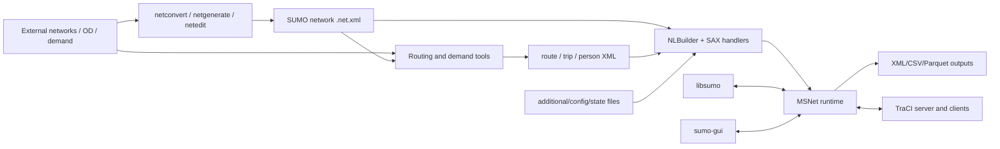
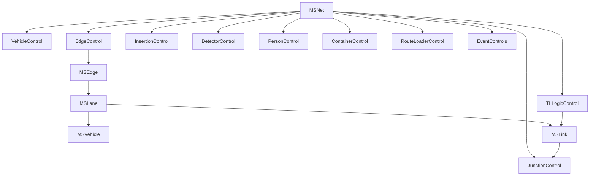

# 01. System architecture

## Ecosystem view

The arrows reflect source call/data dependencies: builders serialize network
files; `NLBuilder`/handlers instantiate runtime objects; `MSNet` owns the step;
interfaces invoke/query that same runtime.

## Architectural layers

### Common infrastructure

`src/utils/` supplies time/types, options, XML parsing, geometry, vehicle
parameters, routing templates, output devices, emissions, GUI utilities and
miscellaneous containers. Most executables depend on portions of this layer.

### Network production

`src/netimport` and `src/netgen` populate `src/netbuild` objects.
`NBNetBuilder::compute()` normalizes topology and derives lane connections,
junction logic, traffic-light definitions and geometry. `src/netwrite`
serializes results. Details: `network/network_generation.md`.

### Routing and demand

`src/router` defines the routing-domain graph/demand model used by router
executables. Generic shortest-path implementations live under
`src/utils/router`. `duarouter`, `jtrrouter`, `dfrouter`, and `marouter` compose
different loaders/costs/assignment behavior. `od` and `activitygen` produce
demand; Python tools orchestrate larger workflows.

### Runtime load

`NLBuilder::init()` registers/options-checks the simulator, creates controls and
`MSNet`, then parses network/additional/route/state inputs through `NLHandler`
and specialized builders. Network data is converted into `MSEdge`, `MSLane`,
`MSLink`, junction and TLS objects. Routes may be streamed during simulation.

### Simulation engine

`MSNet` is the central singleton and timestep scheduler. `MSEdgeControl` invokes
lane planning/movement/lane-change; `MSVehicleControl` owns lifecycle;
`MSInsertionControl` owns departures/flows; `MSTLLogicControl` owns signal
programs; transportable, detector, event, routing and transfer controls provide
specialized state.

### Alternate mesoscopic engine

When enabled, `MELoop`/`MESegment` replace the microscopic lane-motion block,
while surrounding load, demand, interfaces, events and output remain shared.
This is an alternate state/motion resolution, not merely a faster car-follow
model.

### Interfaces

- TraCI: `TraCIServer` decodes socket commands into libsumo-style domain calls.
- libsumo: static in-process domains query/mutate `MSNet` directly.
- libtraci/Python TraCI: client transports over the TraCI protocol.
- GUI: GUI-aware subclasses plus load/run threads and rendering.
- FMI: optional co-simulation adapter over libsumo lifecycle.

## Runtime ownership sketch

This graph is simplified ownership/coordination. Vehicles are globally owned by
`MSVehicleControl` while lane containers reference active vehicles.

## Critical interaction contracts

- Movement order: events/TLS, plan, approach registration, execute, lane
  change, removal, demand/insertion, transfer, end events, outputs/time advance.
- Route topology: a route is edge-level, but each transition needs a permitted
  lane-level `MSLink`.
- Signals and conflicts: TL state is a link constraint; `MSLink` foe and
  downstream checks remain authoritative for conflict safety.
- Vehicle physics: car-following yields longitudinal constraints; lane-changing
  and external influence may patch them before integration.
- State snapshots: static network compatibility plus every participating
  subsystem's state/RNG must align.

## Replaceable versus coupled areas

The GUI, storage containers, socket library, class hierarchy, and many caching
strategies can be replaced behind contracts. Time-step ordering, units, route/
lane/link consistency, controller semantics, lifecycle notifications, and API/
file observable results are strongly coupled and require coordinated tests.

## Primary source anchors

`src/CMakeLists.txt`, `src/sumo_main.cpp`, `src/netload/NLBuilder.cpp`,
`src/microsim/MSNet.cpp`, `src/microsim/MSEdgeControl.cpp`,
`src/traci-server/TraCIServer.cpp`, `src/libsumo/Simulation.cpp`,
`src/gui/GUIRunThread.cpp`.

## Confidence

High.
