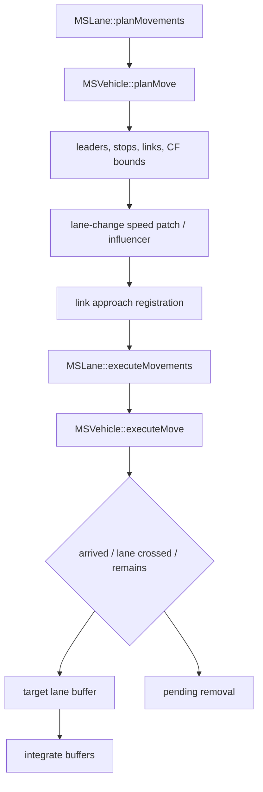

# 03. Execution flow

## Headless startup

`src/sumo_main.cpp::main()`:

1. installs signal handlers;
2. initializes XML and stores argv;
3. calls `NLBuilder::init()`;
4. when a network is returned, calls `MSNet::simulate(begin, end)`;
5. supports reload by rebuilding while state is `SIMSTATE_LOADING`;
6. deletes the network, closes TraCI and `SystemFrame`, and maps exceptions to
   exit status.

`NLBuilder::init()` registers options via `MSFrame::fillOptions()`, parses
configuration/CLI, validates, copies globals, initializes RNG, creates runtime
controls/`MSNet`, and calls `NLBuilder::buildNet()`. `buildNet()` parses the
network and additional data, closes builders, creates route-loader control,
loads state when configured, and finalizes the network.

## Configuration order

```text
register typed options -> preparse CLI -> load configuration XML -> reparse CLI
-> validate cross-option constraints -> initialize globals/streams
```

The second CLI parse gives explicit command-line values precedence. Relative
configuration paths are relocated against the configuration file.

## Runtime-load flow

```text
.net.xml -> NLHandler / edge+junction builders -> MS edge/lane/link/junction/TLS
route files -> route handler / loader control -> routes, types, future demand
additional files -> stops, detectors, rerouters, devices, shapes, outputs
state file -> clear/load state for runtime owners -> restored current time/RNG
closeBuilding -> derived caches/controls ready
```

## Simulation loop

`MSNet::simulate()` sets `myStep=start`, repeatedly calls `simulationStep()`,
checks termination state, logs progress, and calls `closeSimulation()`.

Canonical completed microscopic step (see
`simulation/simulation_engine.md` for exact source anchors):

1. TraCI command gate and optional state save.
2. begin-step events; rail signal update; event-stage collision check.
3. traffic-light switching.
4. patch active lanes.
5. plan vehicle movements.
6. publish junction approaches.
7. execute longitudinal/link movements.
8. movement-stage collisions.
9. lane-changing pass and collision check.
10. finalize pending removals.
11. stream more routes; update waiting transportables.
12. expand demand, run insertion events, emit vehicles, insertion collisions.
13. teleport/parking/jump reinsertion; end-step events.
14. complete TraCI remote effects, outputs/detectors/statistics.
15. increment `myStep` by `DELTA_T`.

Mesoscopic mode replaces steps 4–9 with `MELoop::simulate(myStep)`.

## Two-phase external step

`simulationStep(true)` (libsumo `Simulation::executeMove`) stops after movement,
insertion/transfer/end events and marks completion missing. A later normal call
performs post-move external processing/output/time advance. Consumers must not
treat the half-step as a completed timestep.

## Vehicle update flow



## Output and shutdown

Per-step/interval output occurs after state mutation in `postMoveStep()`.
`closeSimulation()` closes detector intervals and unfinished vehicle/device
outputs, writes final infrastructure outputs and duration/statistics, then
destruction follows dependency-sensitive order in `MSNet::~MSNet()`.

## Order-sensitive rules

- TLS changes before movement affect the current step.
- Approach registration must finish before final link decisions.
- Removal waits until lane iteration is complete.
- Route streaming precedes current-step insertion expansion.
- Outputs observe completed post-control state, then time advances.
- GUI rendering is asynchronous and is not part of deterministic physics order.

## Confidence

High — startup and step sequences were read from `sumo_main.cpp`,
`NLBuilder.cpp`, and `MSNet.cpp`.
