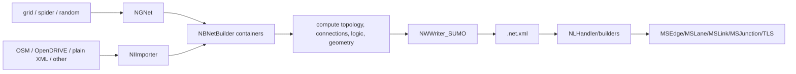

# 04. Data flow

## Network data



Important transformations: coordinate projection and normalization; node/edge
join/split/filter; connection inference; lane geometry; internal lanes;
right-of-way/foe matrices; TL link indices. The runtime network is constructed
from serialized semantics rather than the original importer objects.

## Demand and routes

```text
OD/activity/random/explicit input
 -> trip/flow/person definitions
 -> router graph and shortest/intermodal path (optional offline)
 -> route/person XML
 -> MSRouteHandler / SUMORouteLoaderControl
 -> MSRoute, type, vehicle/person parameters
 -> future/pending insertion
 -> live traffic objects
```

Route files may be streamed by time. Flow definitions remain compact until
`MSInsertionControl::determineCandidates()` expands repetitions.

## Configuration

CLI/config XML flows through `OptionsIO`/`OptionsLoader` into singleton
`OptionsCont`; frame validators enforce subsystem constraints; `MSFrame` copies
hot-path policy into `MSGlobals`; constructors/controllers retain specific
values. Changing an option default can therefore affect parsing, static globals,
constructed state, output headers, and tests.

## Vehicle state through a step

```text
lane ordered state + route + type/model + stops + external commands
 -> leader/link/person queries
 -> planned drive items and safe speed
 -> approach map
 -> movement/link crossing
 -> target-lane buffers
 -> lane-changing/shadow state
 -> collision/removal/transfer
 -> detector/device/output observations
```

## Traffic-light data

Build-time TL definitions and link indices are written to network XML. Netload
creates program variants and maps their state-string positions to `MSLink`s.
Each switch updates link states; vehicles query links during planning/execution;
GUI/API/output read the active program/phase/link state.

## External command/query flow

TraCI: client domain call -> typed binary command -> TCP socket ->
`TraCIServer` dispatch/domain handler -> libsumo domain function -> `MS*` state
-> typed reply/subscription result -> client. libsumo omits serialization/socket
and calls the same domain layer in-process. libtraci uses the remote flow.

## Output flow

Move reminders and devices collect events; detector controls aggregate by
interval; `MSNet::writeOutput()` and dedicated exporters read completed state;
`OutputDevice` serializes XML/text/optional Parquet. Final vehicle device output
is generated during deferred removal, so arrival output is a lifecycle side
effect rather than a generic end-step scan.

## Save/load flow

Static network/config -> create compatible runtime -> state parser clears and
restores controller/lane/vehicle/TLS/transfer/device/RNG state with optional time
offset -> step resumes. A state file is not a standalone replacement for the
network and configuration.

## Principal formats

| Data | Parsers/builders | Internal representation | Writers/consumers |
|---|---|---|---|
| network XML | `NLHandler`, netload builders | runtime `MS*` graph | simulation/API/GUI |
| route/trip/flow/person XML | route handlers/loaders | routes, parameters, future demand | insertion/transportables |
| additional XML | `NLHandler` and specialized handlers | stops, detectors, rerouters, shapes | engine/TLS/output/GUI |
| configuration XML/CLI | options stack | typed `OptionsCont`/globals | every subsystem |
| state XML | `MSStateHandler` + owner loaders | restored live state | continued simulation |
| simulation output | devices/detectors/exporters | transient aggregates | XML/CSV/Parquet clients |

Schemas under `data/xsd/` support format validation, but parser behavior and
functional tests remain necessary evidence for defaults and errors.

## Confidence

High for principal flows; format-specific field coverage is intentionally out of
scope here.
