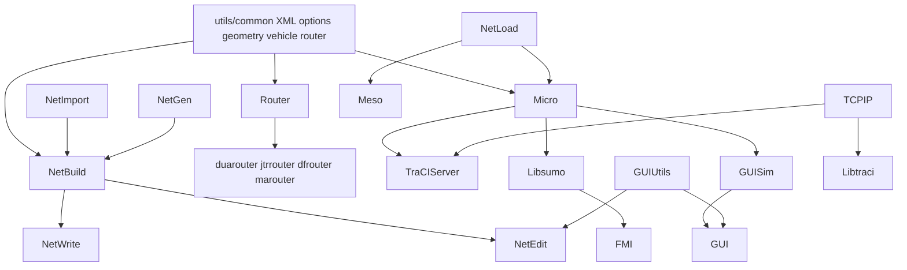
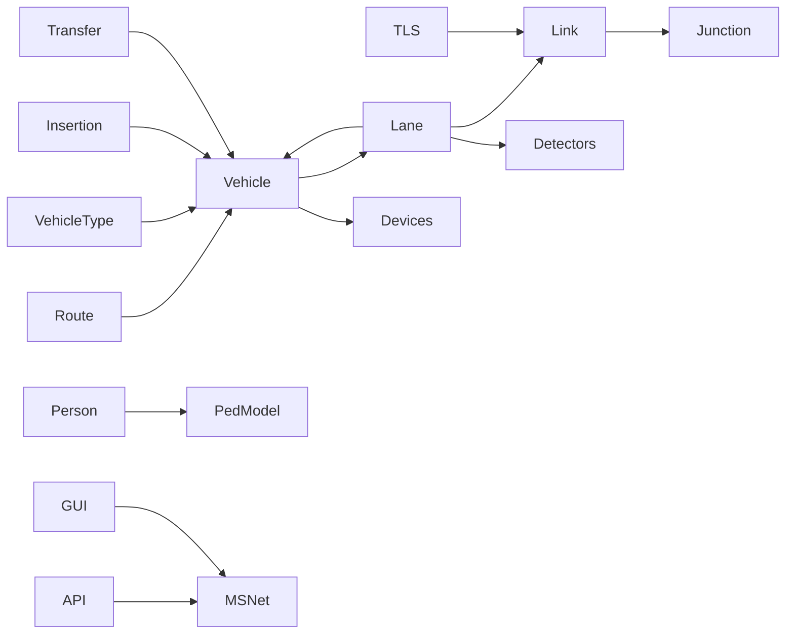

# 11. Dependency map

## Major build/runtime dependencies

Source: library groups and `add_subdirectory`/`target_link_libraries` in
top-level and `src/CMakeLists.txt`, plus subsystem CMake files.

## Component dependency table

| Component | Direct internal dependencies | Important indirect/external dependencies |
|---|---|---|
| `sumo` | netload, microsim, meso, TraCI server, libsumo static | Xerces, zlib/PROJ/fmt etc. through utils |
| `sumo-gui` | all simulator libs + gui/guisim/guinetload/mesogui | FOX, OpenGL; optional OSG/FFMPEG/GL2PS |
| netconvert | netimport, netbuild, netwrite | Xerces; optional GDAL/PROJ |
| netgenerate | netgen, netbuild, netwrite | common RNG/geometry/XML |
| router executables | router + tool-specific domain | generic routers, emissions/vehicle utils |
| netedit | netbuild/import/write + GUI/editor modules | FOX/OpenGL, undo/change model |
| microsim | utils vehicle/router, CF/LC/devices/output/transportables/TLS | optional Eigen/JuPedSim/GEOS, emissions models |
| TraCI server | microsim/libsumo domains, TCPIP, constants | client protocol compatibility |
| libsumo | microsim/netload + domain helpers | SWIG/Python/Java/C# optional |
| libtraci | TCPIP + public domain headers/types | remote SUMO server; SWIG optional |
| Python tools | sumolib/traci and standard/optional packages | external command-line executables |

## Runtime data dependencies

Bidirectional arrows (vehicle/lane) represent coordinated state, not shared
ownership.

## Cycles and coupling

- `MSVehicle` and `MSLane` reference each other; `MSVehicleControl` owns object
  lifetime while lane containers own placement order.
- `MSLink` references lanes and lanes own outgoing links; junction/TLS builders
  close this topology after objects exist.
- Vehicle planning reads lane/link state and writes link approach state that foe
  queries read in the same step.
- GUI subclasses inherit simulation objects, so compile-time GUI→core dependency
  is clear even though runtime view and model reference each other.
- libsumo domains call the engine; TraCI handlers reuse domain semantics, while
  engine stepping also invokes the TraCI server gate. This is an orchestration
  cycle, not duplicated state ownership.

## External dependency roles

Xerces is required XML parsing. FOX/OpenGL enable GUI. SWIG generates language
bindings. PROJ/GDAL handle geospatial formats. Arrow/Parquet enable columnar
output. Eigen supports overhead-wire calculations. JuPedSim+GEOS provide an
optional pedestrian model. FFMPEG/OSG/GL2PS extend visualization. Boost supports
stack/process facilities; gtest provides unit tests. See
`15_LICENSE_AND_ATTRIBUTION.md` for notices, not legal conclusions.

## Confidence

High for major CMake dependencies; not an exhaustive target-level link graph.
