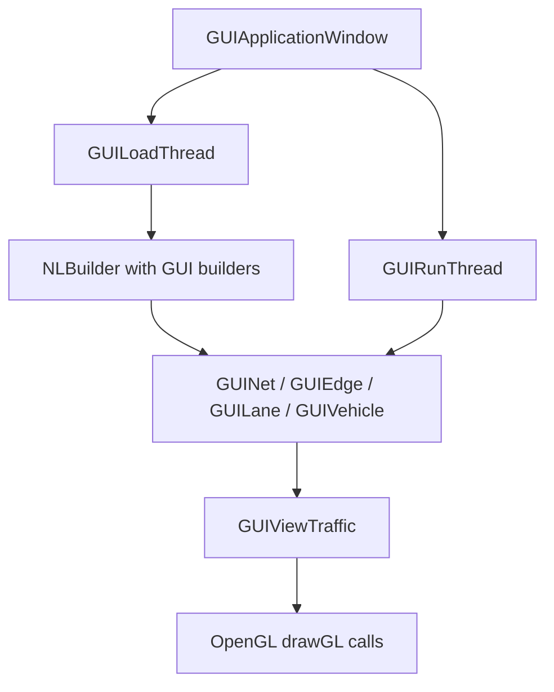

# GUI architecture

## Purpose

`sumo-gui` runs the same simulation semantics as `sumo` while adding an
asynchronous FOX/OpenGL application, GUI-aware runtime subclasses, views,
selection/inspection, snapshots, and optional 3-D rendering. The GUI is not a
second traffic engine.

Primary implementation:

- `src/guisim_main.cpp`
- `src/gui/GUIApplicationWindow.*`, `GUILoadThread.*`, `GUIRunThread.*`
- `src/guisim/GUINet.*`, `GUIVehicle.*`, `GUILane.*`, `GUIEdge.*`
- `src/guinetload/GUIEdgeControlBuilder.*`, `GUIJunctionControlBuilder.*`
- `src/utils/gui/windows/GUISUMOAbstractView.*`

Related tests: `tests/sumo/gui/`, `tests/complex/sumo-gui/`, GUI-domain TraCI
tests under `tests/complex/traci/gui/`.

## Ownership and threads

`GUIApplicationWindow` owns application-level commands, menus, child views,
load/run threads, and event transfer. `GUILoadThread::run()` builds a `GUINet`
using GUI-specific netload builders and posts a simulation-loaded event.
`GUIRunThread` owns start/stop/single-step pacing and invokes simulation steps.
FOX UI operations remain on the GUI thread; simulation and loading communicate
through inter-thread events and guarded state.

## GUI-aware simulation objects

`GUIEdge` derives from `MSEdge`, `GUILane` from `MSLane`, and `GUIVehicle` from
`MSVehicle` (through GUI support classes). They retain core behavior and add
rendering, popup/parameter windows, selection, and locking. `GUILane` overrides
movement/container methods primarily to protect concurrent rendering access,
then delegates to runtime behavior.

`GUINet::simulationStep()` extends `MSNet::simulationStep()` with GUI timing and
value tracking. `GUINet::updateGUI()` requests view refreshes; it must not be
used as the source of simulation truth.

## State boundaries

- Authoritative traffic state remains in `MSNet`/`MS*` base objects.
- Visualization settings, camera, selection, trackers, and decals are GUI state.
- Some GUI commands intentionally mutate simulation state (closing lanes,
  adding rerouters, changing TLS/vehicles). Those operations must use core APIs
  and synchronization, not drawing objects alone.

## Dependencies

FOX and OpenGL/GLU are required for the GUI build. FFMPEG, OpenSceneGraph, and
GL2PS are optional. `src/CMakeLists.txt` links `sumo-gui` to GUI libraries plus
the same simulation libraries as `sumo`.

## Change safety

A replacement GUI can be architecturally different if it preserves a clean
snapshot/command boundary. Do not duplicate car-following, lane changing,
junction, or routing logic in the renderer. Test pause/step/run, concurrent
load/cancel, shutdown, screenshots, and state-changing commands.

## Confidence

High — class inheritance, build links, and load/run thread calls were traced.
