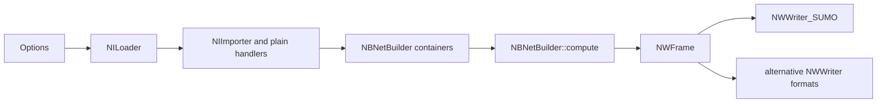

# Network import and export boundaries

## Purpose

The import/export layer translates heterogeneous network formats into and out
of SUMO's normalized build-time model. It prevents format-specific parsers from
becoming independent network engines.

Primary implementation:

- `src/netimport/NILoader.cpp`
- `src/netimport/NIImporter_*.cpp`
- `src/netwrite/NWFrame.cpp`
- `src/netwrite/NWWriter_*.cpp`
- `src/netbuild/NBNetBuilder.h`

Related tests: format branches under `tests/netconvert/import/` and
`tests/netconvert/export/`, plus conversion round trips under `tests/complex/`.

## Responsibilities

- Detect configured inputs and invoke the matching importer in deterministic
  order.
- Translate IDs, coordinates, topology, lane attributes, permissions, controls,
  public transport, shapes, and metadata into `NB*` containers.
- Merge multiple input sources according to options and container conflict
  policies.
- Dispatch normalized output to SUMO or alternative writers.
- Preserve explicit information where supported and make lossy/defaulted
  transformation visible through options, warnings, and output.

## Inputs

`NILoader::load()` coordinates native/plain SUMO input and importers for
OpenStreetMap, VISUM, ArcView shape data, Vissim, DLR/Navteq, OpenDRIVE,
MATSim, and ITSUMO. Some importers are single classes; the larger formats have
subdirectories containing intermediate records and specialized handlers.

Plain XML sources may independently define nodes, edges, connections, types,
traffic lights, public-transport stops/lines, and polygons. External formats
often omit concepts required by SUMO, so options and `NB*` defaults participate
in the mapping.

## Outputs

`NWFrame::writeNetwork()` dispatches the canonical SUMO writer and optional
writers for plain XML, Amitran, DLR/Navteq, MATSim, and OpenDRIVE. Canonical
`.net.xml` is the runtime handoff. Alternative writers represent only the
intersection between the build model and target format and are not guaranteed
lossless round trips.

## State

Importers write into the container set owned by a single `NBNetBuilder`:
nodes, edges, types, districts, TLS definitions, PT stops/lines, parking,
shapes, and related metadata. Coordinate conversion is shared through
`GeoConvHelper`. The normalized/derived state is not complete until
`NBNetBuilder::compute()` finishes.

## Import order and execution

Within `NILoader::load()`, configured sources are invoked in source-defined
order. Native SUMO/plain input is processed before the listed external
importers. XML helper loading follows for remaining plain structures. This
order can affect duplicate IDs, overrides, and which explicit attributes exist
before inference.

The full netconvert flow is:

Writers operate after normalization. A writer must not mutate topology merely
to make its output convenient; target-specific approximation belongs in an
explicit export mapping.

## Important Classes and Functions

| Symbol | Role | Source |
|---|---|---|
| `NILoader::load()` | importer orchestration | `src/netimport/NILoader.cpp` |
| `NILoader::loadXML()` | remaining native/plain XML loading | `src/netimport/NILoader.cpp` |
| `NIImporter_SUMO::loadNetwork()` | SUMO/native network input | `src/netimport/NIImporter_SUMO.cpp` |
| `NIImporter_OpenStreetMap::loadNetwork()` | OSM mapping | `src/netimport/NIImporter_OpenStreetMap.cpp` |
| `NIImporter_OpenDrive::loadNetwork()` | OpenDRIVE mapping | `src/netimport/NIImporter_OpenDrive.cpp` |
| `NIImporter_VISUM::loadNetwork()` | VISUM mapping | `src/netimport/NIImporter_VISUM.cpp` |
| `NWFrame::writeNetwork()` | output selection | `src/netwrite/NWFrame.cpp` |
| `NWWriter_SUMO::writeNetwork()` | canonical runtime network serialization | `src/netwrite/NWWriter_SUMO.cpp` |
| `NWWriter_XML` | plain nodes/edges/connections/TLS and related exports | `src/netwrite/NWWriter_XML.h` |

## Transformation contracts

- Coordinate systems must be converted consistently before geometry-dependent
  computation. Projection metadata must match the written coordinate space.
- Imported edge/lane permissions, directionality, widths, speeds, priorities,
  and IDs must reach the corresponding `NBEdge` records or be explicitly
  defaulted.
- Explicit connections and TLS link indices constrain later inference and must
  be reconciled after topology edits.
- Internal lanes, junction request matrices, inferred connections, and final
  junction shapes are build products; external formats need not contain them.
- Public-transport and district references may require edge matching/splitting
  and must be repaired or rejected consistently.
- Unknown or unsupported source attributes must not silently acquire invented
  semantics.

## Edge Cases

- Multiple inputs can define the same ID with incompatible types or geometry.
- Left-hand networks, bidirectional rail, pedestrian-only ways, roundabouts,
  and grade-separated crossings require format-specific mapping before generic
  computation.
- Broken/missing projection information can produce geometrically plausible
  but geographically wrong output.
- Removing or joining nodes/edges invalidates imported connections and TLS
  references.
- Alternative export followed by reimport may lose internal lanes, custom
  shapes, permissions, or controller details.
- `--ignore-errors` permits selected recovery paths; it is not permission to
  serialize dangling references.

## Modification Points

- Add a source format as an importer that populates existing `NB*` contracts,
  register its options in `NIFrame`, call it from `NILoader`, and add malformed,
  minimal, mixed-input, and projection tests.
- Add an output format through an `NWWriter` and `NWFrame` dispatch. Document
  unsupported/lossy fields and add export plus round-trip tests.
- Change format-independent topology semantics in `netbuild`, not separately
  in each importer.
- Any change to `NB*` field meaning requires auditing every importer, writer,
  Netedit, runtime serialization, and conversion tests.

## Confidence

High for importer/writer inventory, orchestration, and the normalized-model
boundary. Medium for field-level fidelity of every external format; the source
contains extensive format-specific mapping that should be specified separately
when exact interchange compatibility is required.
