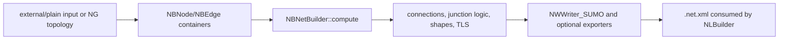

# Network generation and conversion pipeline

## Scope

SUMO has two ways to produce a simulation network:

1. `netconvert` imports or merges external/plain formats into the mutable `NB*`
   model, computes topology and geometry, then writes `.net.xml`.
2. `netgenerate` creates abstract grid, spider, or random `NG*` topology,
   converts it to `NB*`, then uses the same compute/write pipeline.

Primary implementation:

- `src/netconvert_main.cpp`
- `src/netimport/NILoader.cpp`, `src/netimport/NIImporter_*`
- `src/netgen/netgen_main.cpp`, `NGNet.cpp`, `NGRandomNetBuilder.cpp`
- `src/netbuild/NBNetBuilder.cpp`
- `src/netwrite/NWFrame.cpp`, `NWWriter_SUMO.cpp`

Related tests: `tests/netconvert/`, `tests/netgen/`, and network round-trip
scenarios under `tests/complex/`.

## Shared pipeline

`NBNetBuilder::compute()` is a staged normalization pipeline. It removes or
joins structures according to options, computes edge-to-edge and lane-to-lane
connections, turnarounds, crossings, traffic lights, right-of-way logic,
internal-lane geometry, node/edge/lane shapes, and consistency checks. The
order is behavioral: later passes assume earlier topology is stable.

## Importers

`NILoader::load()` calls enabled importers for native SUMO/plain XML,
OpenStreetMap, VISUM, shapefile/ArcView, Vissim, DLR/Navteq, OpenDRIVE, MATSim,
and ITSUMO. Each importer populates the same `NBNetBuilder` containers. Optional
format support depends on build features (for example GDAL and PROJ).

Input data is not necessarily preserved literally. Coordinate conversion,
edge splitting, type defaults, node joining, connection inference, and geometry
repair produce a normalized network.

## Generated topology

`NGNet::createChequerBoard()` creates rectangular grids;
`createSpiderWeb()` creates radial arms/circles; `NGRandomNetBuilder::createNet()`
grows randomized topology with distance, angle, retry, and connectivity
constraints. `NGNet::toNB()` converts `NGNode`/`NGEdge` objects to `NBNode` and
`NBEdge`, optionally adding reverse edges according to bidirectional
probability. After conversion, generated networks are not special: they pass
through `NBNetBuilder::compute()`.

## Outputs

`NWFrame::writeNetwork()` invokes the enabled writers. `NWWriter_SUMO` writes
the simulation network; other writers include plain XML, OpenDRIVE, MATSim,
Amitran, and DLR/Navteq. Export capability is not symmetric with import and may
lose format-specific information.

## Invariants

- Node and edge IDs are unique in their containers.
- Every edge endpoint exists, every lane connection indexes valid lanes, and
  geometry/length values are nondegenerate after validation.
- Connection ordering remains aligned with junction response and TL indices.
- `NBNetBuilder::compute()` must complete before a network is treated as a
  simulation-ready `.net.xml`.

## Modification points

- New source format: a new `NIImporter_*` that populates `NB*` objects.
- New synthetic topology: `NG*`, then reuse `toNB()` and netbuild.
- New normalization rule: place it in the correct phase of
  `NBNetBuilder::compute()` and regression-test all affected exporters.
- New output format: `NWWriter_*` plus `NWFrame` option/dispatch wiring.

## Confidence

High for the shared architecture; medium for format-specific fidelity because
each importer/exporter has its own extensive rules.
