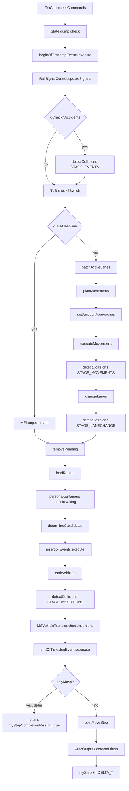

# Simulation Engine (MSNet)

## Purpose
`MSNet` is the central orchestrator of SUMO's microscopic/mesoscopic simulation. It is a process-wide singleton that owns (or references) every subsystem needed to run a simulation: the loaded network topology, the vehicle/person/container populations, insertion and event scheduling, traffic-light logic, detectors, and routers. Its `simulationStep()` method defines the canonical per-timestep execution order that everything else in `src/microsim` plugs into.

```
Source:
src/microsim/MSNet.h (class MSNet)
src/microsim/MSNet.cpp (MSNet::MSNet, MSNet::simulationStep)
```

## Responsibilities
- Construction/teardown of the simulation world (`MSNet::MSNet`, `MSNet::closeBuilding`, `MSNet::~MSNet`).
- Advancing simulated time by exactly `DELTA_T` per call to `simulationStep()`.
- Dispatching each timestep's work to the specialized controllers in a fixed order (events, collisions, TLS switching, movement, lane-changing, insertion, output).
- Owning simulation-wide state: current step counter, singleton pointers to `MSVehicleControl`, `MSEdgeControl`, `MSInsertionControl`, `MSTLLogicControl`, `MSDetectorControl`, `MSEventControl` (three separate queues), person/container controls, routers, and `MSVehicleTransfer`.
- Coordinating with TraCI (`TraCIServer`), which can intercept/step the simulation externally.
- Triggering periodic/one-off state saving (`MSStateHandler::saveState`) and final output flushing/statistics on close (`MSNet::closeSimulation`).
- Tracking global simulation state transitions (loading, running, ended for various reasons) via `MSNet::SimulationState`.

## Inputs
- Parsed network, routes, and additional-file data supplied by `NLBuilder` and
  its specialized builders/handlers, then finalized through `closeBuilding`.
- `OptionsCont` (command-line/config options): begin/end time, teleport thresholds, `max-num-vehicles`, `max-depart-delay`, meso/micro mode, state-saving options, etc.
- TraCI commands (if a client is attached) that can alter vehicle state, request simulation loads, or gate the step.
- Time-dependent `Command` objects registered by devices, detectors, and other subsystems into one of the three `MSEventControl` queues.

## Outputs
- Advances the shared simulation state (vehicle positions, TLS states, detector aggregates) by one timestep.
- Emits standard outputs (tripinfo, vehroute, summary, queue, charging-station, substation, rail-signal-block, statistics) via `writeOutput()`/`closeSimulation()`.
- Writes simulation-state XML snapshots (`MSStateHandler::saveState`) at configured times/periods.
- Returns/exposes `SimulationState` (e.g. `SIMSTATE_END_STEP_REACHED`,
  `SIMSTATE_NO_FURTHER_VEHICLES`, `SIMSTATE_TOO_MANY_TELEPORTS`) used by
  `MSNet::simulate()` in the native run loop, or interpreted by an embedding
  host that advances libsumo explicitly, to decide when to stop.

## State
Key members of `MSNet` (see `src/microsim/MSNet.h`):
- `myStep` — current simulation time (`SUMOTime`, integer milliseconds internally).
- `myVehicleControl`, `myEdges` (`MSEdgeControl*`), `myJunctions`, `myLogics` (`MSTLLogicControl*`), `myInserter` (`MSInsertionControl*`), `myDetectorControl`, `myPersonControl`, `myContainerControl`, `myRouteLoaders`, `myShapeContainer`.
- Three independent event queues: `myBeginOfTimestepEvents`, `myEndOfTimestepEvents`, `myInsertionEvents` (all `MSEventControl*`).
- `myStepCompletionMissing` / `postMoveStep()` split — supports TraCI's "onlyMove" mode where a step is executed in two phases (movement, then TraCI post-processing) to let external controllers intervene mid-step.
- Collision bookkeeping (`CollisionMap`, per-stage collision counters) and teleport/statistics counters (delegated mostly to `MSVehicleControl`).
- Cached routers (`myRouterTT`, `myRouterEffort`, `myPedestrianRouter`) keyed by vehicle class.
- Global flags mirrored into `MSGlobals` (a separate static-only class) for fast access from hot paths (`MSGlobals::gUseMesoSim`, `gCheck4Accidents`, `gTimeToGridlock`, etc.) — see `other_simulation_behaviour.md`/`MSGlobals.h`.

## Dependencies
- `MSEdgeControl` (per-lane movement orchestration), `MSInsertionControl` (departure), `MSVehicleControl` (fleet lifecycle), `MSVehicleTransfer` (teleport handling), `MSEventControl` (scheduled callbacks), `MSTLLogicControl` (traffic lights), `MSDetectorControl` (induction loops etc.), `MSStateHandler` (save/load), `libsumo`/`TraCIServer` (external control), `MSGlobals` (static config mirror), meso engine `MELoop`/`MSGlobals::gMesoNet` as an alternate code path.

## Consumers
- The command-line entry point `src/sumo_main.cpp` and GUI orchestration under
  `src/gui/` drive stepping until `simulationState()` signals termination.
- `libsumo`/TraCI bindings call into `MSNet` for both stepping and querying/mutating simulation objects.
- GUI (`src/gui/...`) subclasses and wraps `MSNet` behavior for visualization but reuses the same stepping logic.

## Execution — the per-timestep order
`MSNet::simulationStep()` (src/microsim/MSNet.cpp, ~line 800) executes, in order, for the **microscopic** path (the mesoscopic path replaces the middle block with `MSGlobals::gMesoNet->simulate(myStep)`):

1. **TraCI command processing** — if a client is attached, `TraCIServer::processCommands` runs first and can early-return (e.g., to load a new scenario or if the connection closed).
2. **State dump check** — if `myStep` matches a scheduled state-dump time/period, `MSStateHandler::saveState` is invoked.
3. **Begin-of-timestep events** — `myBeginOfTimestepEvents->execute(myStep)`.
4. **Rail signal update** — `MSRailSignalControl::updateSignals` (if rail signals exist).
5. **Collision detection (STAGE_EVENTS)** — if `gCheck4Accidents`.
6. **TLS program switching check** — `myLogics->check2Switch(myStep)`.
7. **Core movement (micro only):**
   a. `myEdges->patchActiveLanes()` — reconcile the active-lane set.
   b. `myEdges->planMovements(myStep)` — compute safe speeds / register link approaches, per lane.
   c. `myEdges->setJunctionApproaches()` — register junction approach info for right-of-way decisions.
   d. `myEdges->executeMovements(myStep)` — actually move vehicles, resolve right-of-way, integrate vehicles onto new lanes.
   e. Collision detection (STAGE_MOVEMENTS).
   f. `myEdges->changeLanes(myStep)` — lane-changing pass.
   g. Collision detection (STAGE_LANECHANGE).
8. **Flush removals** — `myVehicleControl->removePending()` (vehicles that arrived or were removed due to collision during movement/lane-change).
9. **Route file streaming** — `loadRoutes()` (incrementally parses more vehicles/routes if the route file is large / not fully loaded).
10. **Person/container waiting checks** — `checkWaiting` for transportables (if enabled).
11. **Insertion:**
    a. `myInserter->determineCandidates(myStep)` — expand flows into concrete vehicles and precompute which pending vehicles could depart this step.
    b. `myInsertionEvents->execute(myStep)` — a dedicated event queue for insertion-time triggers.
    c. `myInserter->emitVehicles(myStep)` — perform the actual `MSEdge::insertVehicle` calls.
    d. Collision detection (STAGE_INSERTIONS).
12. **Teleport/parking bookkeeping** — `MSVehicleTransfer::getInstance()->checkInsertions(myStep)` (advances vehicles being teleported/parked).
13. **End-of-timestep events** — `myEndOfTimestepEvents->execute(myStep)`.
14. If called with `onlyMove == true` (TraCI "execute move" mode), the function returns early (`myStepCompletionMissing = true`) so a second entry into `simulationStep()` performs step 15 (`postMoveStep`) after TraCI has had a chance to act.
15. `postMoveStep()`: post-processes TraCI remote-controlled vehicles (with a further collision check), removes stale collision records, writes detector/output data (`writeOutput()`), updates performance counters, and finally increments `myStep += DELTA_T`.



```
Source:
src/microsim/MSNet.cpp (MSNet::simulationStep, lines ~799-945)
src/microsim/MSNet.cpp (MSNet::postMoveStep, lines ~948-974)
```

## Simulation time representation
Time is represented as `SUMOTime`, a signed integer type counted in milliseconds
(see `src/utils/common/SUMOTime.h`). `DELTA_T` is the fixed simulation step
length (default 1000 ms = 1s, configurable). `STEPS2TIME`/`TIME2STEPS` convert
between `SUMOTime` and floating-point seconds. `myStep` is monotonically
incremented by `DELTA_T` once per completed step; there is no variable/adaptive
timestep in the microscopic core.

## Startup sequence (construction)
1. `MSNet::MSNet(...)` — establishes the singleton (`throws` if one already exists), reads `begin`/teleport/log options from `OptionsCont`, constructs `MSInsertionControl` and `MSDetectorControl`, stores the three event-queue pointers (which are actually constructed by the caller/loader and passed in), and — if mesoscopic — constructs `MELoop`.
2. `MSNet::closeBuilding(...)` — called once network/route/additional loading has finished; wires in `MSEdgeControl`, `MSJunctionControl`, `SUMORouteLoaderControl`, `MSTLLogicControl`, computes derived network properties (`checkElevation`, `checkWalkingarea`, `checkBidiEdges`), and records state-dump configuration.
3. XML parsing/network construction that supplies these calls is coordinated by
   `NLBuilder`/`NLHandler` and specialized runtime builders; route/demand
   parsing uses the corresponding route loaders and handlers documented in the
   data-flow and routing chapters.

## Shutdown sequence
`MSNet::closeSimulation(start, reason)` (src/microsim/MSNet.cpp ~line 756): closes the detector control, flushes queue/stop-output/vehroute/tripinfo unfinished-output writers, writes charging-station/overheadwire/substation/rail-signal-block outputs if configured, prints/writes duration statistics, and performs a final periodic summary-output flush. `MSNet::~MSNet()` then deletes every owned subsystem in a carefully chosen order (documented inline in the destructor): junctions/detector/edges/inserter/logics/route-loaders first, transportable controls next, `myVehicleControl` after transportables (vehicles may reference persons/containers), then `myShapeContainer` (must be destroyed before the event queues because its destructor deschedules its own commands), then the three event queues, then routers and traction substations.

## Behaviour notes / Edge cases
- **Two-phase stepping for TraCI**: `onlyMove` lets TraCI run "half a step" (movement without output/TraCI post-processing) so it can inject commands between movement and finalization; `myStepCompletionMissing` guards re-entrancy.
- **Collision detection is staged**: the same `detectCollisions` call is invoked after events, movements, lane-changes, insertions, and remote-control post-processing, each tagged with a `stage` string, so collisions introduced by different phases are attributed correctly and not double-reported (`removeOutdatedCollisions` cleans up cross-step duplicates).
- **Meso vs micro** are structurally different: meso replaces edge/lane movement+lanechange with a single `MELoop::simulate` call operating on segments/queues instead of individual lane physics.
- **Route loading is incremental**: `loadRoutes()` is called every step to support very large route files that are streamed rather than fully parsed upfront.

## Tests
No dedicated unit tests for `MSNet` were found under `unittest/src/microsim` (only `MSCFModelTest.cpp`, `MSCFModel_IDMTest.cpp`, `MSEventControlTest.cpp` exist there). End-to-end behavior is validated by the functional test suite under `tests/sumo` (large corpus of scenario-based tests comparing output XML against expected results; not enumerated here as it is data-driven rather than source).

## Modification Points
- To add a new per-step phase (e.g., a new global subsystem), the natural insertion point is within `simulationStep()`, choosing before/after the relevant existing phase based on data dependencies (e.g., anything depending on final vehicle positions must run after `executeMovements`/`changeLanes`).
- To change stepping granularity/adaptive timestep would require touching `DELTA_T` usage network-wide — this is a deep architectural change, not a local one.
- Global toggles (meso vs micro, teleport thresholds, collision checking) are centralized in `MSGlobals`, making them a natural place to add new simulation-wide feature flags.

## Confidence
High — the step order (list of 15 phases) is read directly from `MSNet::simulationStep`/`postMoveStep` source; class responsibilities are cross-checked against `MSNet.h` declarations and Doxygen comments.
