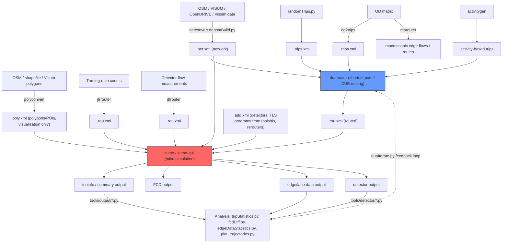

# SUMO Tool Ecosystem — Overview

SUMO is not one binary; it is a family of C++ command-line tools (all sharing `utils/options/OptionsCont` for CLI/config handling and `utils/xml` for I/O) plus a large Python tool collection (`tools/`) built on `sumolib`. This document catalogs the pieces and shows how data flows between them. `netconvert`, `netgenerate`, and `duarouter` are covered in depth by their own documents in this knowledge base; they are referenced here only for context.

## C++ command-line tools

| Tool | Source dir | Main entry | Purpose (one paragraph) |
|---|---|---|---|
| `netconvert` | `src/netconvert_main.cpp`, supported by `src/netimport/`, `src/netbuild/`, and `src/netwrite/` | `netconvert_main.cpp` | Builds/converts a SUMO `.net.xml` from plain-XML node/edge input or 3rd-party formats (OSM, VISUM, Vissim, OpenDRIVE...). Covered elsewhere. |
| `netgenerate` | `src/netgen/netgen_main.cpp`, supported by `src/netgen/` | `netgen_main.cpp` | Procedurally generates synthetic networks (grid, spider, random). Covered elsewhere. |
| `duarouter` | `src/duarouter` | `duarouter_main.cpp` | Static/dynamic-user-equilibrium router: trips → routes. Covered elsewhere. |
| `od2trips` | `src/od2trips_main.cpp` + `src/od` | `od2trips_main.cpp:253 main()` | Converts an Origin-Destination matrix (`ODMatrix`, `src/od/ODMatrix.h`) plus TAZ/district definitions (`ODDistrictCont::loadDistricts`, `src/od/ODDistrictCont.h`) into individual `<trip>` elements. Reads district/TAZ files via `-n/--taz-files`, matrix data via `ODMatrix::loadMatrix`, and requires at least one loaded district and one loaded demand cell before writing trips. It performs no routing itself — routing happens downstream in `duarouter`, `jtrrouter`, or `marouter`. |
| `dfrouter` | `src/dfrouter` | `dfrouter_main.cpp` (classes `RODFDetector`, `RODFDetectorFlow`, `RODFEdge`, `RODFDetFlowLoader`) | "Detector flow router": reconstructs plausible routes/traffic demand from real induction-loop/detector flow measurements plus a network, rather than from an OD matrix — used to seed a simulation so that simulated detector output matches measured detector output. |
| `jtrrouter` | `src/jtrrouter` | `jtrrouter_main.cpp`, `ROJTRRouter` (`src/jtrrouter/ROJTRRouter.h`) | "Junction turning-ratio router": computes routes for input trips/flows using per-junction turning-percentage definitions instead of an OD matrix or full shortest-path routing — useful when only turn-count survey data is available. |
| `marouter` | `src/marouter` | `marouter_main.cpp`, `ROMAAssignments` (`src/marouter/ROMAAssignments.h`) | "Macroscopic assignment router": performs macroscopic traffic assignment (e.g. iterative/incremental all-or-nothing or capacity-restrained assignment) of an OD matrix onto a network, producing edge flows/routes without microscopic simulation — a faster, coarser alternative to iterative duarouter+sumo (`duaIterate.py`) loops. |
| `activitygen` | `src/activitygen` | `activitygen_main.cpp`, `AGActivityGen` (`src/activitygen/AGActivityGen.h`) | Generates synthetic activity-based demand (population going to work/school/shopping etc. on a schedule) for a city, producing trips from statistical city/activity models (`src/activitygen/city`, `src/activitygen/activities`) rather than from measured OD data. |
| `polyconvert` | `src/polyconvert` | `polyconvert_main.cpp:240 main()` | Importer of polygons and POIs (buildings, land use, points of interest) from external formats (OSM, ArcView/shapefile, Visum, DLR-Navteq, plain XML — see `PCLoaderOSM`, `PCLoaderArcView`, `PCLoaderVisum`, `PCLoaderDlrNavteq`, `PCLoaderXML` in `src/polyconvert`) into SUMO's `.poly.xml`, used purely for visualization/context, not simulation logic. |
| `traci_testclient` | `src/traci_testclient` | `tracitestclient_main.cpp`, `testlibsumo_main.cpp`, `testlibtraci_main.cpp`, `TraCITestClient` (`src/traci_testclient/TraCITestClient.h`) | A scripted TraCI/libsumo/libtraci exerciser: reads a command script and issues the corresponding TraCI API calls against a running simulation, used mainly by SUMO's own test suite to validate the TraCI/libsumo/libtraci protocol implementations, not an end-user tool. |

All of these share the same startup skeleton (`XMLSubSys::init()`, `fillOptions()`, `OptionsIO`, `MsgHandler`, `SystemFrame`) visible in `od2trips_main.cpp` and `polyconvert_main.cpp` — one more piece of evidence that they are built from the same `utils/` application framework as `sumo`/`netconvert`.

## `tools/` — the Python tool collection

`tools/sumolib` (see `sumolib.md`) underlies almost everything here. Top-level layout (`tools/`, non-exhaustive, grouped by enumerated subdirectory):

| Subdir | Contents / purpose |
|---|---|
| `assign/` | `duaIterate.py` (iterative dynamic user equilibrium: alternates duarouter + sumo + route-cost feedback), `one-shot.py`, `cadytsIterate.py` (calibration via CADYTS), cost/analysis helpers |
| `detector/` | Induction-loop/detector post-processing: `detector.py`, `flowrouter.py`, `edgeDataFromFlow.py`, `validate.py`, flow aggregation/filtering |
| `district/` | TAZ/district construction and OD-matrix/district manipulation: `districtMapper.py`, `gridDistricts.py`, `stationDistricts.py` |
| `drt/` | Demand-responsive transit dispatch algorithms: `drtOnline.py`, `drtOrtools.py`, `darpSolvers.py` (dial-a-ride problem solvers, some using Google OR-Tools) |
| `emissions/` | HBEFA emission-model helpers (`hbefa2sumo.py`, `nefz.py`) |
| `import/` | Format converters into SUMO inputs: `osm/`, `gtfs/` (public transit schedules → SUMO PT), `matsim/`, `opendrive/`, `vissim/`, `visum/`, `dxf/`, `citybrain/` |
| `net/` | Post-processing/inspection of `.net.xml` beyond netconvert: `netcheck.py`, `netdiff.py`, `net2geojson.py`, `net2kml.py`, `cut_net.py`, `remap_*.py`, rail-specific patchers (`patchRailConflicts.py`, `patchRailPriorities.py`) |
| `output/` | Post-simulation analytics over tripinfo, FCD, edge-data, and similar output: `tripStatistics.py`, `edgeDataStatistics.py`, `fcdDiff.py`, `computePassengerCounts.py`, `analyze_teleports.py` |
| `route/` | Route-file manipulation: `cutRoutes.py`, `routeSampler.py` (top-level), `sort_routes.py`, `routecheck.py`, `route2OD.py` |
| `shapes/` | POI/polygon generation and conversion (complements `polyconvert`) |
| `tls/` | Traffic-light program tooling: `tls_csv2SUMO.py`, `tlsCoordinator.py` (top-level), `tls_analyzeSplit.py` |
| `contributed/` | Externally contributed, loosely-integrated tools (`saga`, `traas` — Java TraCI bindings, `traci4matlab`, `lisum`) |
| `libsumo/`, `libtraci/` | Python bindings packages for the in-process (`libsumo`) and socket-based (`libtraci`) simulation control APIs |
| top-level scripts | `randomTrips.py` (random/OD-weighted trip generation), `osmBuild.py`/`osmGet.py`/`osmWebWizard.py` (OSM→net.xml convenience wrappers around netconvert), `routeSampler.py`, `ptlines2flows.py` (GTFS/PT line → flow conversion), `plot_trajectories.py`, `tlsCoordinator.py`, `runSeeds.py` |

## Typical tool-chain data flow

`sumolib` (Python) is the common substrate that reads/writes `.net.xml`/`.rou.xml`/output files for nearly every box on the right/bottom of this diagram; the C++ routers (`od2trips`, `dfrouter`, `jtrrouter`, `marouter`, `duarouter`) are the substrate for demand→route conversion on the left/middle. `activitygen` and `polyconvert` are auxiliary demand/visualization generators feeding the same pipeline. `traci_testclient` and the `libsumo`/`libtraci` Python packages sit outside this static-file pipeline entirely — they drive or observe a *running* `sumo`/`sumo-gui` process instead of producing/consuming files.

See also: `docs/reverse_engineering/tools/sumolib.md`.
